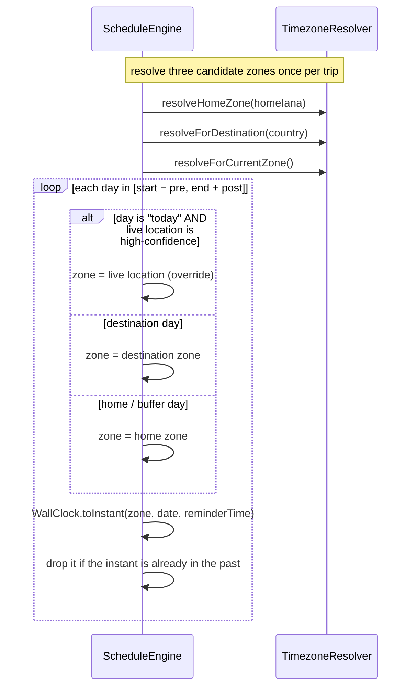
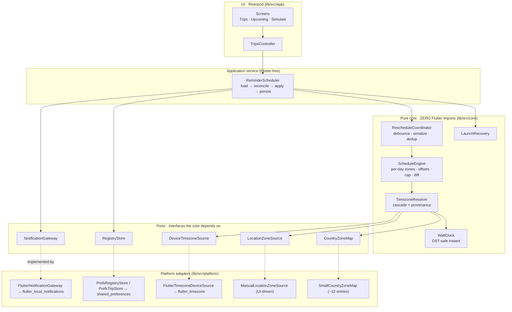
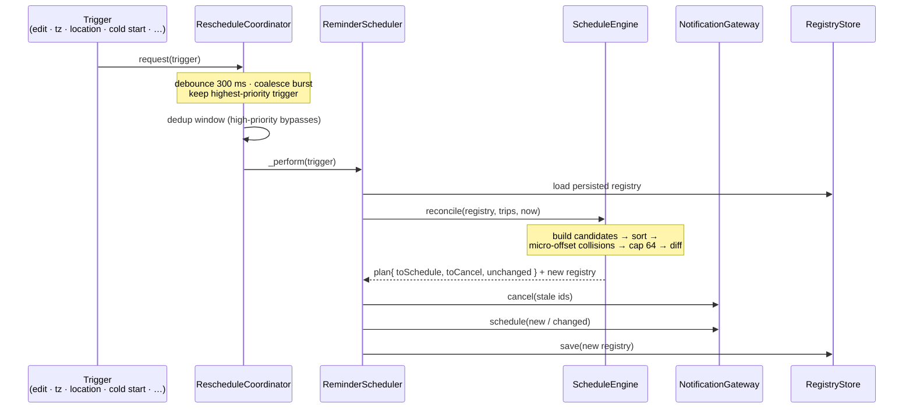

# Flutter Trip Reminder Scheduler


A reference implementation of **timezone-aware local notification scheduling** for
recurring reminders that *travel with the user*. You define a trip — a home zone, a
destination, dates, and a daily reminder time — and the engine schedules reminders
that fire at the right wall-clock time in the right zone for each day: your home zone
before you leave and after you get back, the destination zone while you're away.

The interesting part is not the UI. It is the scheduling engine: a **pure,
framework-agnostic Dart core** that resolves a wall-clock time + an IANA zone into an
absolute UTC instant (handling the days that don't exist and the days that happen
twice), reconciles a desired schedule against what's already persisted without
duplicating, and funnels a dozen kinds of "something changed, reschedule" events
through one debounced, serialized entry point. The Flutter app on top is deliberately
minimal.

> This repo is extracted and fully sanitized from a production travel-health app. The
> scheduling ideas are the substance worth publishing; the medical domain, backend,
> encryption, and real geolocation are gone (see
> [What is deliberately NOT here](#what-is-deliberately-not-here)).

## Why naive scheduling breaks

The obvious approach — keep a `DateTime` for "09:00 tomorrow" and hand it to the OS —
is wrong in two ordinary situations:

- **Travel.** "09:00" is a *wall-clock* intention. `09:00` in New York and `09:00` in
  Tokyo are 14 hours apart as absolute instants. A reminder stored as a naive local
  `DateTime` either fires at the wrong moment after you cross zones, or silently
  assumes the phone's current zone for a day you'll spend somewhere else.
- **Daylight saving.** Twice a year a wall-clock hour either **doesn't exist**
  (spring-forward skips 02:00→03:00) or **happens twice** (fall-back repeats
  01:00–01:59). A `DateTime` has no opinion about either; the OS will do *something*,
  just not necessarily the something you want.

The fix is to treat the **absolute instant** (a UTC epoch) as the source of truth, and
to compute that instant deliberately from `(wall-clock time, IANA zone, calendar day)`
using the real zone-transition history. That computation, and everything that has to
happen around it to stay correct over time, is what this project is about.

## What this project demonstrates

| Pattern | Problem it solves | Where |
|---|---|---|
| Schedule absolute instants, never wall-clock | "09:00" is a different instant in every zone and across DST; a stored `DateTime` drifts | [`wall_clock.dart`](lib/src/core/wall_clock.dart), [`scheduled_reminder.dart`](lib/src/core/models/scheduled_reminder.dart) |
| Resolution cascade that reports its provenance | "Which zone?" has several fallible answers; callers must know *which* won and *how much* to trust it | [`timezone_resolver.dart`](lib/src/core/timezone_resolver.dart) |
| Per-occurrence zone selection (the travel-aware core) | Each day picks home / destination / live-location-today by context | [`schedule_engine.dart` → `candidatesFor`](lib/src/core/schedule_engine.dart) |
| Explicit DST gap/overlap handling | Spring-forward times don't exist; fall-back times exist twice | [`wall_clock.dart`](lib/src/core/wall_clock.dart) |
| Idempotent reconciliation against a registry | Repeated reschedules must converge, not pile up duplicates | [`schedule_engine.dart` → `reconcile`](lib/src/core/schedule_engine.dart), [`reminder_registry.dart`](lib/src/core/models/reminder_registry.dart) |
| Deterministic ids + collision offsets + a cap | Stable ids make diffs possible; same-minute reminders get nudged apart; iOS caps pending at ~64 | [`schedule_engine.dart`](lib/src/core/schedule_engine.dart) |
| One debounced, serialized, de-duplicated entry point | Many triggers; uncoordinated they race and duplicate work | [`reschedule_coordinator.dart`](lib/src/core/reschedule_coordinator.dart) |
| Launch-time recovery | The OS clears pending notifications on reboot; the app can sit idle across a DST change | [`launch_recovery.dart`](lib/src/core/launch_recovery.dart) |
| A test seam by design | Every timezone / travel / DST scenario is reproducible with no GPS, network, or device clock | [`ports/`](lib/src/core/ports), [`test/`](test) |

## The hard problem: reminders that travel with you

A single trip produces one reminder per day across a window: an optional pre-trip
buffer, the trip itself, an optional post-trip buffer. The non-obvious requirement is
that **each day chooses its own timezone**:

- **Home days** (the buffers, before departure and after return) use the **home zone**.
- **Destination days** (between the start and end dates) use the **destination zone**,
  resolved from a country name through the resolver — so the schedule is built for
  where you *will be*, not where you are now.
- **Today**, if a high-confidence **live-location** signal says you're somewhere else,
  that live zone *overrides* the phase. You're in transit through Dubai on the way to
  Bangkok? Today's reminder uses Dubai; future days still use Bangkok.



The whole selection is a pure function of `(trip, now)` plus three injected sources, so
the test [`per_day_zone_selection_test.dart`](test/per_day_zone_selection_test.dart)
pins every branch with no GPS and no real clock.

## Background concepts

The collapsible sections below summarize the timekeeping concepts the rest of the
document assumes. Skip them if they're familiar.

<details>
<summary><b>IANA timezones</b> — what an id like <code>Europe/London</code> actually is</summary>

<br/>

An **IANA timezone** (e.g. `America/New_York`, `Africa/Lagos`, `Asia/Kolkata`) is not
a fixed UTC offset — it's a *named set of rules* describing how a region's offset has
changed over history, including when daylight saving starts and ends. `Europe/London`
is UTC+0 in January and UTC+1 in July. `Asia/Kolkata` is a permanent UTC+05:30.
`Pacific/Apia` sits east of the date line at UTC+13/+14.

Because the offset depends on the *instant*, you cannot reduce a zone to a number. The
[`timezone`](https://pub.dev/packages/timezone) package ships the IANA database and a
`TZDateTime` type that knows the full transition history, which is what makes correct
conversion possible. This project never hard-codes an offset; it always asks the zone.

</details>

<details>
<summary><b>Wall-clock time vs. absolute instant</b> — the distinction the whole design rests on</summary>

<br/>

A **wall-clock time** is what a clock on the wall reads: "09:00 on March 31st". It is
*ambiguous on its own* — it means a different moment in every zone, and (around DST) it
can be ambiguous or impossible even within one zone.

An **absolute instant** is a single point on the universal timeline, best represented
as a UTC epoch (milliseconds since 1970). It is unambiguous everywhere.

Scheduling must ultimately be in absolute instants — the OS fires an alarm at a moment,
not at "whenever a clock somewhere reads 09:00". So the reminder a user *expresses*
(a wall-clock time) has to be *resolved* against a concrete zone and date to get the
instant. This repo keeps the wall-clock time zone-free in
[`ReminderTime`](lib/src/core/models/reminder_time.dart) and only ever turns it into an
instant through [`WallClock.toInstant`](lib/src/core/wall_clock.dart). The persisted
truth is the resulting UTC instant.

</details>

<details>
<summary><b>DST gaps and overlaps</b> — the days that don't exist and the days that happen twice</summary>

<br/>

When a zone springs forward, the clock jumps (e.g. New York, 2024-03-10: `02:00 → 03:00`).
The wall-clock times `02:00`–`02:59` **never happen** that day — a *gap*. A reminder set
for `02:30` has no literal instant.

When a zone falls back, the clock repeats (New York, 2024-11-03: `02:00 → 01:00`). The
wall-clock times `01:00`–`01:59` happen **twice** — an *overlap*. A reminder set for
`01:30` is *ambiguous*: there are two instants it could mean.

Neither case can be left to chance. This project resolves a **gap** by accepting the
forward shift (a `02:30` reminder fires at the shifted `03:30` rather than vanishing),
and an **overlap** by deliberately choosing the *later*, standard-time occurrence so the
answer is always consistent. Both rules are spelled out in
[`wall_clock.dart`](lib/src/core/wall_clock.dart) and tested against real transitions in
[`dst_test.dart`](test/dst_test.dart).

</details>

## Architecture at a glance



The dependency rule points inward: **UI → service → core**, and the core depends only
on the **ports** (narrow interfaces). The platform plugins sit entirely behind those
ports, which is the whole reason the engine and resolver can be unit-tested with fakes
and no device. `ReminderScheduler` lives under `lib/src/app/` but imports no Flutter —
it is the seam between "decide what to schedule" (pure) and "tell the OS" (adapter).

### The reschedule / reconcile flow



## Timezone handling strategy

The resolver ([`timezone_resolver.dart`](lib/src/core/timezone_resolver.dart)) answers
"which zone?" through an ordered cascade and **returns its provenance**, never a bare
string. Each result carries `{ iana, source, confidence, fallbackReason }`
([`ResolvedZone`](lib/src/core/models/resolved_zone.dart)):

| Tier | Source | Confidence |
|---|---|---|
| 1 | live location (the "today" override) | high |
| 2 | device system timezone | medium |
| 3 | last-known persisted zone | low |
| 4 | country heuristic (country → IANA map) | medium, or **low** for multi-zone countries |
| 5 | device-locale country | fallback |
| 6 | UTC | fallback |

A trip's **home zone** takes a different path: the user chose it explicitly, so a
valid id resolves directly as `userChosen` at *high* confidence — an explicit choice
outranks any inferred signal — and only an invalid id falls into the cascade (with the
location tier disabled). Destination days likewise skip the live-location tier: you are
scheduling for a place you are not yet at.

Two design choices matter here. First, a country that spans multiple zones (United
States, Brazil, Australia) resolves at *lower confidence* and says so — the schedule
view surfaces that, so a `low`-confidence `America/New_York` for "United States" is
visibly hedged. Second, the resolver depends only on three injected ports, so every
tier is reproducible in [`resolver_cascade_test.dart`](test/resolver_cascade_test.dart)
without touching a device.

## DST handling strategy

All DST logic lives in one short pure function,
[`WallClock.toInstant`](lib/src/core/wall_clock.dart):

- **Gap (spring-forward).** The `timezone` package normalizes a non-existent wall time
  forward; we detect that the hour we got back differs from the hour we asked for and
  *accept* the shift. A reminder for a skipped `02:30` fires at `03:30` rather than
  disappearing.
- **Overlap (fall-back).** We build the candidate for the *later*, standard-time
  occurrence — the wall clock read as UTC minus the post-transition offset — and accept
  it only if it **round-trips back to exactly the requested wall time** and lands after
  the first occurrence. That verification deliberately chooses the **later** occurrence
  so an ambiguous time always resolves the same way, and (unlike a fixed one-hour probe)
  stays correct for sub-hour transitions such as Lord Howe Island's 30-minute shift.
  Building from `DateTime.utc(...)` keeps the result independent of the host device's
  own offset.

[`dst_test.dart`](test/dst_test.dart) verifies both against real 2024 transitions in
both hemispheres (New York and Sydney) and a sub-hour one (Lord Howe), plus a control
that an unambiguous time is
returned untouched. These tests are the actual proof of correctness — see
[Common pitfalls](#common-pitfalls) for why a simulator can't be.

## Key engineering decisions

- **The core is pure Dart with zero Flutter imports.** This is the headline claim. It
  is what lets the genuinely tricky logic — cascade, DST math, reconciliation diff,
  debounce — be tested as plain functions. The only non-SDK packages the core touches
  are `timezone` and `clock`, both pure Dart.
- **Time is injected, never read ambiently in the hot path.** The engine and recovery
  take `now` as a parameter; the coordinator reads `package:clock`'s ambient clock,
  which `fakeAsync` overrides in tests. Nothing in the core calls `DateTime.now()`
  directly (the UI uses it only for default form dates and trip ids).
- **Deterministic notification ids.** An id is a stable hash of `(tripId, dayIndex)`
  ([`ScheduleEngine.deterministicId`](lib/src/core/schedule_engine.dart)), so the same
  day always maps to the same id across runs — the precondition for diffing instead of
  cancel-everything-and-re-add.
- **Reconciliation returns an explicit three-way diff.** `{ toSchedule, toCancel,
  unchanged }` makes idempotence *testable*: identical inputs yield empty schedule and
  cancel lists.
- **Riverpod for the thin UI.** It doubles as lightweight dependency injection (the
  ports are provided once and overridden with fakes in tests), and it keeps the widgets
  dumb — they render `state` and call controller methods, never touching a plugin.
- **One orchestrator, many triggers.** Every reschedule reason routes through
  `ReminderScheduler.request` → the coordinator, so there is exactly one place where a
  schedule actually happens.

## Tradeoffs

- **Pick the later occurrence on fall-back.** Choosing standard time over daylight time
  for an ambiguous wall-clock is a *policy*, not a law. It's consistent and documented;
  an app that would rather fire at the first occurrence would change one branch and one
  test.
- **A 64 cap, soonest-first.** Capping to fit iOS's pending limit means a very long or
  very dense schedule loses its furthest-out reminders until the next reschedule tops
  the queue back up. That's the right trade for a phone, but it is a trade.
- **Explicit diff vs. reschedule-everything.** The diff is more code than "cancel all,
  add all," and it must keep the registry honest about what the OS holds (see the
  OS-cleared path). In return you get idempotence and far fewer redundant OS calls.
- **Country → single representative zone.** The demo map returns one primary zone per
  country and lowers confidence for multi-zone ones, rather than asking the user to
  disambiguate. A production app would refine by region/state (and say so).

## Common pitfalls

- **Storing wall-clock `DateTime`s.** The root mistake. Store the **instant**; keep the
  wall-clock time as zone-free intent and resolve it per day.
- **Assuming a zone is an offset.** `Europe/London` is not "+0"; it's +0 or +1 depending
  on the instant. Always resolve against the date.
- **Letting the gap/overlap "just happen."** Without explicit handling, a spring-forward
  reminder can silently vanish and a fall-back reminder can fire an hour off. Decide a
  policy and test it.
- **Trusting the registry after a reboot.** The OS clears pending notifications on
  reboot, but your persisted registry still claims they exist — so a plain diff would
  conclude "nothing changed" and reschedule nothing. The OS-cleared path detects this
  (registry non-empty, OS reports zero pending) and forces a full resync.
- **Believing the simulator.** An iOS simulator / Android emulator **cannot change the
  device clock or timezone**, so you cannot reproduce a real DST crossing by hand. That
  is exactly why the DST math is a pure function with unit tests, and why the app has a
  "simulate device timezone change" control that drives the injected source instead of
  the real clock.

## Platform realities

| Reality | How the design accommodates it |
|---|---|
| **iOS caps pending local notifications at ~64.** | The engine caps the desired set at 64, soonest-first ([`schedule_engine.dart`](lib/src/core/schedule_engine.dart)), and launch-time recovery periodically replenishes the queue. |
| **Android 12+ gates exact alarms.** | The manifest declares `SCHEDULE_EXACT_ALARM` (≤ API 32) and `USE_EXACT_ALARM` (33+); the bootstrap requests the permission, and scheduling uses `AndroidScheduleMode.exactAllowWhileIdle` ([`flutter_notification_gateway.dart`](lib/src/platform/flutter_notification_gateway.dart)). |
| **The OS clears pending notifications on reboot.** | `RECEIVE_BOOT_COMPLETED` + the plugin's boot receiver re-arm them; independently, [`launch_recovery.dart`](lib/src/core/launch_recovery.dart) detects the registry-non-empty-but-OS-empty case and resyncs. |
| **`flutter_local_notifications` uses `java.time`.** | Core-library desugaring is enabled in [`android/app/build.gradle.kts`](android/app/build.gradle.kts), without which the Android build fails. |
| **Apps sit idle for days, across DST.** | Launch recovery distinguishes cold start (> 6 h), periodic replenish (> 20 days), and a DST shift (stored zone's offset differs now). |
| **Background execution is limited.** | The design does no background work — it reschedules at launch and on foreground triggers, and relies on the OS to fire already-scheduled instants. |

## Requirements & setup

Toolchain: a recent **Flutter 3.x** (built and tested with Flutter 3.44 / Dart 3.12).
Android Studio / SDK for Android; Xcode for iOS.

```bash
flutter pub get
flutter run        # runs on an emulator/simulator (no real GPS or clock needed)
```

iOS dependencies are managed by **Swift Package Manager** (there is no `Podfile`);
Flutter resolves them automatically on the first `flutter run` / build, so there is
no separate `pod install` step.

## Running the demo

1. **Add a trip** (Trips tab → *Add trip*): choose a home zone, a destination country,
   dates, a daily reminder time, and optional buffer days. Saving schedules the
   reminders.
2. **Inspect the schedule** (Upcoming tab): every scheduled reminder with its resolved
   fire time, IANA zone, resolution **source**, and **confidence** — this screen is the
   window into what the engine decided (it mirrors the persisted registry).
3. **Exercise the hard paths** (Simulate tab):
   - *Simulate "I'm in zone X today"* sets a high-confidence live signal; watch only
     today's reminder switch zones on the Upcoming screen.
   - *Simulate a device timezone change* overrides the zone the resolver's device tier
     reports and re-runs the scheduler with the `timezoneChanged` trigger. The schedule
     deliberately stays put — home and destination days keep their trip zones, and only
     a high-confidence live-location signal can override today; the device tier is the
     resolver's fallback for when a trip's own zones can't resolve.
   - *Force a DST-transition reschedule* re-runs the scheduler with that trigger.

Because the location and device-timezone sources are injectable, none of this needs a
real GPS fix or a changed device clock.

## Repository layout

```
lib/
  main.dart                         App entry: build async singletons, inject, run
  src/
    core/                           Pure Dart — ZERO Flutter imports
      models/                       Immutable value types + enums
      ports/                        Narrow interfaces the core depends on
      timezone_resolver.dart        Provenance-carrying resolution cascade
      wall_clock.dart               DST-safe wall-clock → absolute instant
      schedule_engine.dart          Per-day zones, offsets, cap, reconciliation diff
      reschedule_coordinator.dart   Debounce / serialize / de-duplicate triggers
      launch_recovery.dart          Cold-start / OS-cleared / periodic / DST decision
    platform/                       Adapters: plugins behind the ports
    app/                            Riverpod UI + ReminderScheduler orchestrator
test/                               Deterministic unit tests (no clock/GPS/OS)
```

## Where to start reading

Ordered from the most approachable to the most involved.

- **See it decide.** Run the app, add a trip, open the Upcoming tab. Then read
  [`schedule_engine.dart` → `candidatesFor`](lib/src/core/schedule_engine.dart) — the
  per-day zone selection is the heart of the project.
- **The instant math.** [`wall_clock.dart`](lib/src/core/wall_clock.dart) and its tests
  [`wall_clock_to_instant_test.dart`](test/wall_clock_to_instant_test.dart) +
  [`dst_test.dart`](test/dst_test.dart).
- **Provenance.** [`timezone_resolver.dart`](lib/src/core/timezone_resolver.dart) with
  [`resolver_cascade_test.dart`](test/resolver_cascade_test.dart).
- **Convergence.** [`schedule_engine.dart` → `reconcile`](lib/src/core/schedule_engine.dart)
  and [`reconciliation_test.dart`](test/reconciliation_test.dart).
- **Funneling triggers.** [`reschedule_coordinator.dart`](lib/src/core/reschedule_coordinator.dart)
  and [`trigger_coordinator_test.dart`](test/trigger_coordinator_test.dart).
- **Recovery + wiring.** [`launch_recovery.dart`](lib/src/core/launch_recovery.dart),
  [`reminder_scheduler.dart`](lib/src/app/reminder_scheduler.dart), and the end-to-end
  [`scheduler_integration_test.dart`](test/scheduler_integration_test.dart).

## Testing

```bash
flutter test
```

The 50 tests run with no radio, no network, and no real clock — fakes are injected
through the ports and time is controlled with `package:clock` / `fakeAsync`.

- [`resolver_cascade_test.dart`](test/resolver_cascade_test.dart) — each tier wins under
  the right conditions, UTC when all fail, provenance is correct, multi-zone country
  degrades confidence.
- [`wall_clock_to_instant_test.dart`](test/wall_clock_to_instant_test.dart) — conversion
  across zones incl. a half-hour offset and a date-line case.
- [`dst_test.dart`](test/dst_test.dart) — spring-forward gap and fall-back overlap in
  both hemispheres, plus a sub-hour (Lord Howe, 30-minute) transition.
- [`per_day_zone_selection_test.dart`](test/per_day_zone_selection_test.dart) — home vs.
  destination vs. today-override.
- [`reconciliation_test.dart`](test/reconciliation_test.dart) — no duplicates on re-run,
  exact-id reschedule on edit, exact-id cancel on removal, the cap, collision spacing,
  and cross-trip id-collision freedom.
- [`trigger_coordinator_test.dart`](test/trigger_coordinator_test.dart) — debounce,
  serialize, dedup, high-priority bypass, and recovery from a failed run.
- [`launch_recovery_test.dart`](test/launch_recovery_test.dart) — OS-cleared, cold
  start, periodic, DST-shift detection.
- [`scheduler_integration_test.dart`](test/scheduler_integration_test.dart) — the
  orchestrator end to end over fakes, including OS-cleared full resync.

## Adapting it for your own app

This is a **reference implementation**, not a published package. Points to address when
building on it:

- **Change the identifiers.** `com.example.trip_reminder_scheduler` is a placeholder
  application id / bundle id; set your own before shipping.
- **Swap the adapters, keep the core.** Replace
  [`ManualLocationZoneSource`](lib/src/platform/manual_location_zone_source.dart) with a
  real GPS + reverse-geocoding implementation of `LocationZoneSource`; replace
  [`SmallCountryZoneMap`](lib/src/platform/small_country_zone_map.dart) with a full
  dataset (and add region/state refinement). The engine and resolver don't change.
- **Carry your own content.** Reminders here are generic ("Trip reminder"). Pass real
  titles/bodies through `ReminderScheduler`'s content builders, or extend the model.
- **Persist however you like.** `RegistryStore` is plain `shared_preferences` JSON;
  point it at a database or an encrypted store by writing one adapter.

## What is deliberately NOT here

Non-goals that mark the boundary of this implementation:

- **No backend, accounts, or sync** — no GraphQL/Amplify/Cognito, no login.
- **No encryption** — the source app used an encrypted Hive box; this uses plain
  `shared_preferences` so the scheduling logic stays the focus.
- **No real geolocation** — the live-location source is a UI-driven fake; there is no
  GPS, reverse geocoding, or background location.
- **No background processing** — no background fetch / background geolocation; the
  design reschedules at launch and on foreground triggers only.
- **No domain content** — no medical/medication, surveys, or study logic; reminders are
  generic.
- **No localization, app badges, analytics, or branding.**

## License

MIT — see [LICENSE](LICENSE). Uses the open-source
[`timezone`](https://pub.dev/packages/timezone),
[`flutter_local_notifications`](https://pub.dev/packages/flutter_local_notifications),
[`flutter_timezone`](https://pub.dev/packages/flutter_timezone), and
[`flutter_riverpod`](https://pub.dev/packages/flutter_riverpod) packages, fetched as
dependencies rather than vendored here.
